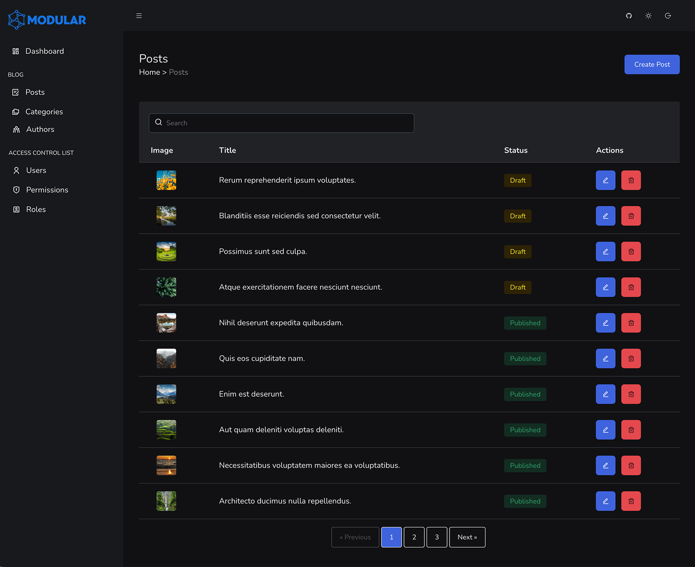

# Modular Demo App

A demo application to illustrate some concepts of a Modular App.

<p align="center" style="margin: 24px;">
    <a href="https://docs.ismodular.com" target="_blank">
    </a>
</p>

<center>

[](https://vuejs.org/)
[](https://inertiajs.com/)
[](https://laravel.com)
[](https://tailwindcss.com/)
[](https://github.com/daniel-cintra/modular-demo/actions)

</center>

## Installation

Clone the repo locally:

```sh
git clone https://github.com/daniel-cintra/modular-demo.git modular-demo && cd modular-demo
```

Install PHP dependencies:

```sh
composer install
```

Setup configuration:

```sh
cp .env.example .env
```

Generate application key:

```sh
php artisan key:generate
```

Configure the database settings in you `.env` file. If you want to use SQLite, create the database file:

```sh
touch database/database.sqlite
```

Run database migrations and seeder:

```sh
php artisan migrate:fresh --seed
```

Create a symlink to the storage:

```sh
php artisan storage:link
```

Run the dev server (the output will give the address):

```sh
php artisan serve
```

You're ready to go! Visit the url in your browser, and login with:

-   **Username:** root@user.com
-   **Password:** password

## The Demo App will provide you with examples of:

-   The ACL (Access Control List) System.
-   Some of the Custom Vue 3 Components, provided by Modular (Templates, Sidebar, Data Table, Form Components, Integrated Text Editor, Flash Messages, etc).
-   How Laravel, Vue and Inertia.js communicate with each other.
-   A possible way to organize the file structure of a Modular Project.
-   Smooth transitions between pages.
-   The GitHub repository for this demo app includes examples of workflows to standardize the styles of the PHP files using Laravel Pint, and the Vue and JavaScript files using Prettier. There is also a workflow to handle tests. Feel free to check it out!
